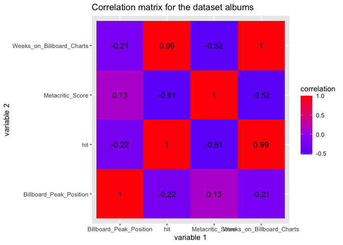
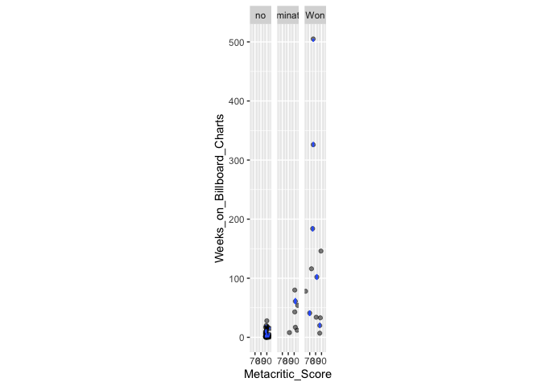
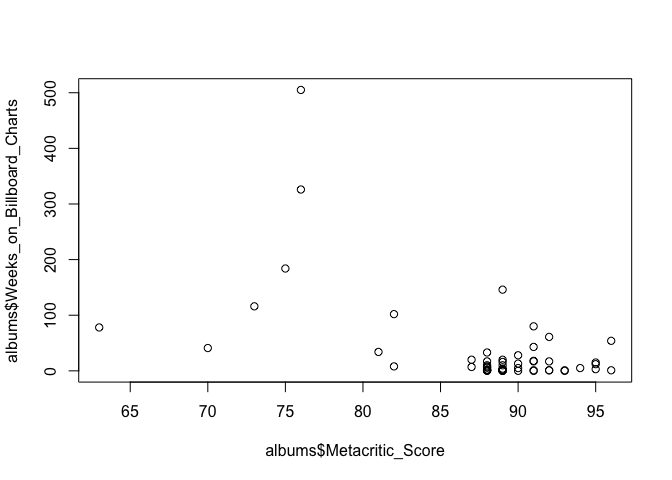
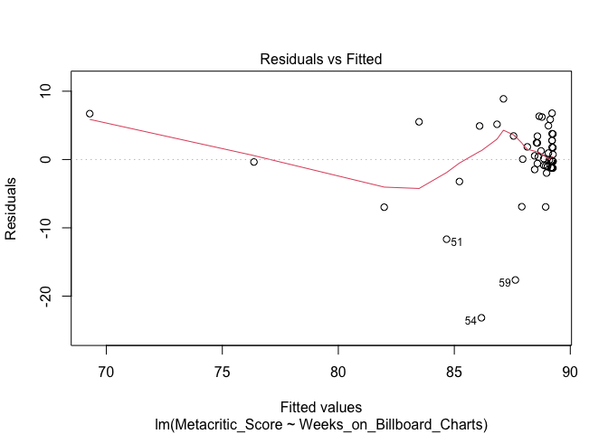
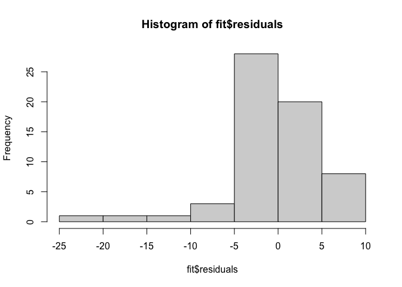
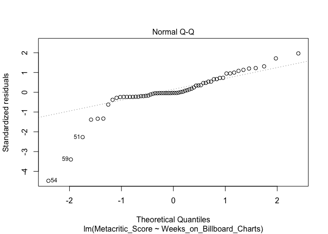
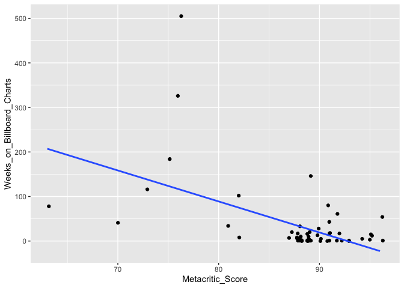

Project 2
================
Victor Diaz
4/17/2021

``` r
#set up R Studio 
library(tidyverse)
```

    ## ── Attaching packages ─────────────────────────────────────── tidyverse 1.3.0 ──

    ## ✓ ggplot2 3.3.3     ✓ purrr   0.3.4
    ## ✓ tibble  3.0.5     ✓ dplyr   1.0.3
    ## ✓ tidyr   1.1.2     ✓ stringr 1.4.0
    ## ✓ readr   1.4.0     ✓ forcats 0.5.0

    ## ── Conflicts ────────────────────────────────────────── tidyverse_conflicts() ──
    ## x dplyr::filter() masks stats::filter()
    ## x dplyr::lag()    masks stats::lag()

``` r
library(readxl)
#set working directory
setwd("~/Desktop")
```

## Intro

The Grammy’s is a yearly awards show that recognizes musicians for their
hard work.Recently I have noticed that many musicians are not recognized
and most of the awards go to the most popular artists. The following
report investigates this idea to see if it is true. To begin, two
datasets were imported “Metacritic highest scoring albums of the 2010s”
and “fan favorite albums”.The former is data from the metacritic site
that displays the best 50 albums from the best decade and their score
according to the metacritics. The latter dataset is data taken from the
billboard top album chart for the same albums from metacritic dataset
and includes data for peak billboard position, weeks on the billboard
charts, and if the album won a grammy.I also added ten albums that won
Grammys to the datasets to see their impact on the results. I really
enjoy music an thought this project would be really fun to do. I chose
this topic because I recently watched the Grammys.I expect a correlation
between the billboard peak variable and if the album won a Grammy.

``` r
#Import data into R Studio and Rename them
library(readxl)
metacritic <- read_excel("metacritic highest scoring albums of the 2010s.xlsx")
billboard <- read_excel("fan favorite best albums.xlsx")
#view datasets
#View(metacritic)
#view(billboard)
#Join two datasets by using the common variable "album". Use "inner_join" to do this
albums <-inner_join(metacritic,billboard, by = "Album")
#new dataset created with the first two datasets. No cases were dropped during the merge. I chose this join because I knew all the data had a matches in both datasets.
```

’’

## EDA

To begin I created a summary table and correlation matrix to see any
basic trends in my data.I found for the group of grammy winners, the
average number of weeks on the charts is 141 while the albums not
reconized averaged 5 weeks.I then plotted a correlation between the
variables in the dataset. I found that there is a negative correlation
between the metacritic score and the number of weeks an album stays on
the billboard charts.I also noticed that Kendrick Lamar has the highest
rated and most albums on the metacritic dataset.However, he has only
been nominated for his albums and has never won a Grammy for album of
the year.

``` r
#summary statistics
#The following codes use the summary function with different function in order to obtain desired summary statistics.
albums%>%
  summarise(mean_metacriticscore = mean(`Metacritic_Score`))
```

    ## # A tibble: 1 x 1
    ##   mean_metacriticscore
    ##                  <dbl>
    ## 1                 87.9

``` r
#The mean of the variable "metacritic Score" is 87.9.
albums%>%
  summarise(sd_metacriticscore = sd(`Metacritic_Score`))
```

    ## # A tibble: 1 x 1
    ##   sd_metacriticscore
    ##                <dbl>
    ## 1               6.09

``` r
#The standard deviation of metacritic score is 6.09.
albums%>%
  summarise(var_metacriticscore = var(`Metacritic_Score`))
```

    ## # A tibble: 1 x 1
    ##   var_metacriticscore
    ##                 <dbl>
    ## 1                37.1

``` r
#The variance for the metacritic score is 37.1.
albums%>%
  summarise(n_metacritic = n())
```

    ## # A tibble: 1 x 1
    ##   n_metacritic
    ##          <int>
    ## 1           62

``` r
#The number of observations for metacritic is 62.
albums%>%
  arrange(`Metacritic_Score`)
```

    ## # A tibble: 62 x 6
    ##    Album     Artist   Metacritic_Score Billboard_Peak_… Weeks_on_Billboa… Grammy
    ##    <chr>     <chr>               <dbl>            <dbl>             <dbl> <chr> 
    ##  1 Babel     Mumford…               63                1                78 Won   
    ##  2 24K Magic Bruno M…               70                4                41 Won   
    ##  3 Fearless  Taylor …               73                1               116 Won   
    ##  4 25        Adele                  75                1               184 Won   
    ##  5 21        Adele                  76                1               505 Won   
    ##  6 1989      Taylor …               76                1               326 Won   
    ##  7 Morning … Beck                   81                3                34 Won   
    ##  8 When We … Billie …               82                1               102 Won   
    ##  9 Father o… Vampire…               82                1                 8 nomin…
    ## 10 The Subu… Arcade …               87               40                20 Won   
    ## # … with 52 more rows

``` r
#The minimum value for metacritic score is 63.
albums%>%
  arrange(desc(`Metacritic_Score`))
```

    ## # A tibble: 62 x 6
    ##    Album    Artist    Metacritic_Score Billboard_Peak_P… Weeks_on_Billbo… Grammy
    ##    <chr>    <chr>                <dbl>             <dbl>            <dbl> <chr> 
    ##  1 To Pimp… Kendrick…               96                 1               54 nomin…
    ##  2 Ghosteen Nick Cav…               96                 6                1 no    
    ##  3 DAMN     Kendrick…               95                 2               12 nomin…
    ##  4 Black M… D'Angelo                95                 5               15 no    
    ##  5 Skeleto… Nick Cav…               95                13                3 no    
    ##  6 My Beau… Kanye We…               94                 3                5 no    
    ##  7 A Crow … Mount Ee…               93                 0                0 no    
    ##  8 Room 25  Noname                  93                 4                1 no    
    ##  9 Lemonade Beyonce                 92                 2               17 nomin…
    ## 10 Sunbath… Deafheav…               92               112                1 no    
    ## # … with 52 more rows

``` r
#The maximum value for metacritic score is 96.
albums%>%
  summarise(quantile_metacritic = quantile(`Metacritic_Score`))
```

    ## # A tibble: 5 x 1
    ##   quantile_metacritic
    ##                 <dbl>
    ## 1                  63
    ## 2                  88
    ## 3                  89
    ## 4                  91
    ## 5                  96

``` r
#The quantile values for metacritic are 63,88,89,91,and 96.
albums%>%
  summarise(n_distinctmetacritic = n_distinct(`Metacritic_Score`))
```

    ## # A tibble: 1 x 1
    ##   n_distinctmetacritic
    ##                  <int>
    ## 1                   17

``` r
#The distinct values for the metacritic score is 17.
albums%>%
  summarise(cor_metacritic = cor(`Metacritic_Score`,y= `Billboard_Peak_Position`))
```

    ## # A tibble: 1 x 1
    ##   cor_metacritic
    ##            <dbl>
    ## 1          0.133

``` r
#The corrilation between the metacritic score and peak spot on the billboard charts is 0.133.
albums%>%
  summarise(med_metacritic =median(`Metacritic_Score`))
```

    ## # A tibble: 1 x 1
    ##   med_metacritic
    ##            <dbl>
    ## 1             89

``` r
#The median value for metacritic score is 89.

albums%>%
  summarise(mean_peak = mean(`Billboard_Peak_Position`))
```

    ## # A tibble: 1 x 1
    ##   mean_peak
    ##       <dbl>
    ## 1      16.0

``` r
#The mean of the variable "Billboard Peak Position" is 16.
albums%>%
  summarise(sd_peak = sd(`Billboard_Peak_Position`))
```

    ## # A tibble: 1 x 1
    ##   sd_peak
    ##     <dbl>
    ## 1    27.9

``` r
#The standard deviation of peak position is 27.9.
albums%>%
  summarise(var_peak = var(`Billboard_Peak_Position`))
```

    ## # A tibble: 1 x 1
    ##   var_peak
    ##      <dbl>
    ## 1     776.

``` r
#The variance for the peak position is 776.
albums%>%
  summarise(n_peak = n())
```

    ## # A tibble: 1 x 1
    ##   n_peak
    ##    <int>
    ## 1     62

``` r
#The number of observations for peak position is 62.
albums%>%
  select(`Billboard_Peak_Position`)%>%
  arrange(`Billboard_Peak_Position`)
```

    ## # A tibble: 62 x 1
    ##    Billboard_Peak_Position
    ##                      <dbl>
    ##  1                       0
    ##  2                       0
    ##  3                       0
    ##  4                       0
    ##  5                       0
    ##  6                       0
    ##  7                       1
    ##  8                       1
    ##  9                       1
    ## 10                       1
    ## # … with 52 more rows

``` r
#The minimum value for metacritic score is 0 weeks.
albums%>%
  select(`Billboard_Peak_Position`)%>%
  arrange(desc(`Billboard_Peak_Position`))
```

    ## # A tibble: 62 x 1
    ##    Billboard_Peak_Position
    ##                      <dbl>
    ##  1                     142
    ##  2                     112
    ##  3                      88
    ##  4                      60
    ##  5                      55
    ##  6                      54
    ##  7                      52
    ##  8                      50
    ##  9                      40
    ## 10                      40
    ## # … with 52 more rows

``` r
#The maximum value for the peak position is 142 weeks.
albums%>%
  summarise(quantile_peak = quantile(`Billboard_Peak_Position`))
```

    ## # A tibble: 5 x 1
    ##   quantile_peak
    ##           <dbl>
    ## 1           0  
    ## 2           1  
    ## 3           3.5
    ## 4          13  
    ## 5         142

``` r
#The quantile values for peak postion are 0,1,3.5,13,and 142.
albums%>%
  summarise(n_distinctpeak = n_distinct(`Billboard_Peak_Position`))
```

    ## # A tibble: 1 x 1
    ##   n_distinctpeak
    ##            <int>
    ## 1             25

``` r
#The distinct values for the peak position is 25.
albums%>%
  summarise(cor_peak = cor(`Billboard_Peak_Position`,y= `Weeks_on_Billboard_Charts`))
```

    ## # A tibble: 1 x 1
    ##   cor_peak
    ##      <dbl>
    ## 1   -0.207

``` r
#The corrilation between the peak billboard position and weeks on the charts is -0.207.
albums%>%
  summarise(med_peak =median(`Billboard_Peak_Position`))
```

    ## # A tibble: 1 x 1
    ##   med_peak
    ##      <dbl>
    ## 1      3.5

``` r
#The median value for peak position is 3.5.

weeks_stats<-albums%>%
  summarise(mean_weeks = mean(`Weeks_on_Billboard_Charts`),
            sd_weeks= sd(`Weeks_on_Billboard_Charts`),
            var_weeks =var(`Weeks_on_Billboard_Charts`),
            quantile_weeks = quantile(`Weeks_on_Billboard_Charts`),
            n_distinctweeks = n_distinct(`Weeks_on_Billboard_Charts`),
            cor_weeks = cor(`Weeks_on_Billboard_Charts`, y= `Metacritic_Score`),
            med_weeks = median(`Weeks_on_Billboard_Charts`))
#The mean for the variable "weeks on billboard charts" is 33.76, the standard deviation is 80.84, the variation is 6536, the number of entries is 62, the minimum weeks are 0, the maximum weeks is 505, the distinct number of weeks is 32, the corilation with the metacritic score is -0.525, and the median value is 6.
#create a new variable that shows the number of weeks divided by peak position to show the impact of the album.
albums <-albums%>%
  mutate(hit = `Weeks_on_Billboard_Charts`/`Billboard_Peak_Position`)
#Find the statistics for grammy winners, nomineess, and non nominees by grouping by the grammy variable.
albums_grammywin <- albums%>%
 group_by(Grammy )%>%
  summarise(mean_weeks = mean(`Weeks_on_Billboard_Charts`),
            sd_weeks= sd(`Weeks_on_Billboard_Charts`),
            var_weeks =var(`Weeks_on_Billboard_Charts`),
            quantile_weeks = quantile(`Weeks_on_Billboard_Charts`),
            n_distinctweeks = n_distinct(`Weeks_on_Billboard_Charts`),
            cor_weeks = cor(`Weeks_on_Billboard_Charts`, y= `Metacritic_Score`),
            med_weeks = median(`Weeks_on_Billboard_Charts`))
```

    ## `summarise()` has grouped output by 'Grammy'. You can override using the `.groups` argument.

``` r
#Create table to organize and display statistics using dash method.

#Statistic Metric Score Peak on Billboard Weeks on Billboard Grammy Winners Grammy Nominess Grammy Losers
#---------------------------------------------------------------------------------------------------------
#mean     |87.9        |16               |33.76             |141.72        |39.29          |5.25         
#sd       |6.09        |27.9             |80.84             |151.24        |27.62          |6.89         
#variance |37.1        |776              |80.84             |22875         |763.23         |47.48        
#n        |62          |62               |62                |12            |7              |43           
#min      |63          |0                |0                 |7             |8              |0            
#max      |96          |142              |505               |505           |80             |28           
#n_distinc|17          |25               |32                |1             |1              |1            
#corilatio|0.133-vspeak|-0.207(vs.weeks) |-5.525(vs.meta)   |NA            |NA             |NA            
#median   |89          |3.5              |6                 |102           |43             |2   
 
#heat map
  # Build a correlation matrix between selected numeric variables
  albums_num <- albums %>%
  select_if(is.numeric) 
cor(albums_num, use = "pairwise.complete.obs")
```

    ##                           Metacritic_Score Billboard_Peak_Position
    ## Metacritic_Score                 1.0000000               0.1327269
    ## Billboard_Peak_Position          0.1327269               1.0000000
    ## Weeks_on_Billboard_Charts       -0.5246963              -0.2072912
    ## hit                             -0.5121445              -0.2213052
    ##                           Weeks_on_Billboard_Charts        hit
    ## Metacritic_Score                         -0.5246963 -0.5121445
    ## Billboard_Peak_Position                  -0.2072912 -0.2213052
    ## Weeks_on_Billboard_Charts                 1.0000000  0.9949761
    ## hit                                       0.9949761  1.0000000

``` r
##Use ggplot to create correlation matrix
cor(albums_num, use = "pairwise.complete.obs") %>%
  as.data.frame %>%
  rownames_to_column %>%
  pivot_longer(-1, names_to = "other_var", values_to = "correlation") %>%
  ggplot(aes(rowname, other_var, fill=correlation)) +
  geom_tile() +
  scale_fill_gradient2(low="blue",mid="purple",high="red") +
  geom_text(aes(label = round(correlation,2)), color = "black", size = 4) +
  labs(title = "Correlation matrix for the dataset albums", x = "variable 1", y = "variable 2")
```

<!-- -->

## MANOVA

A MANOVA test was performed to test for any corelations between the
numeric variables in regards to the categorical variable ‘Grammy’.The
data met assumptions of random and independent observations and no
extreme outliers in the data.A plot was used to check for normality
visually.qrt The results of these tests show there is a signifigance in
the weeks an album was on the top charts and if the album won a grammy.
This is seen with the p-value of 6.635e-07.

``` r
#check assumptions
#The data are random and indepedent observation were made. No extreme outliers found.
# look at multivariate plots of response variable for each species to check for normality
ggplot(albums, aes(x = Metacritic_Score, y = Weeks_on_Billboard_Charts)) +
  geom_point(alpha = .5) + 
  geom_density_2d(h=2) + 
  coord_fixed() + 
  facet_wrap(~Grammy)
```

<!-- -->

``` r
# Perform MANOVA 
manova_albums <- manova(cbind(Metacritic_Score,Weeks_on_Billboard_Charts) ~ Grammy, data = albums)
# look at MANOVA Results
summary(manova_albums)
```

    ##           Df  Pillai approx F num Df den Df    Pr(>F)    
    ## Grammy     2 0.64533   14.053      4    118 2.086e-09 ***
    ## Residuals 59                                             
    ## ---
    ## Signif. codes:  0 '***' 0.001 '**' 0.01 '*' 0.05 '.' 0.1 ' ' 1

``` r
  #  MANOVA is significant. Perform one-way ANOVA for each variable
  summary.aov(manova_albums)
```

    ##  Response Metacritic_Score :
    ##             Df Sum Sq Mean Sq F value    Pr(>F)    
    ## Grammy       2 1217.8  608.92  34.321 1.298e-10 ***
    ## Residuals   59 1046.8   17.74                      
    ## ---
    ## Signif. codes:  0 '***' 0.001 '**' 0.01 '*' 0.05 '.' 0.1 ' ' 1
    ## 
    ##  Response Weeks_on_Billboard_Charts :
    ##             Df Sum Sq Mean Sq F value    Pr(>F)    
    ## Grammy       2 152541   76271  18.281 6.635e-07 ***
    ## Residuals   59 246160    4172                      
    ## ---
    ## Signif. codes:  0 '***' 0.001 '**' 0.01 '*' 0.05 '.' 0.1 ' ' 1

``` r
    # post-hoc analysis
    # metacritic score
    pairwise.t.test(albums$Metacritic_Score,albums$Grammy, p.adj="none")
```

    ## 
    ##  Pairwise comparisons using t tests with pooled SD 
    ## 
    ## data:  albums$Metacritic_Score and albums$Grammy 
    ## 
    ##           no      nominated
    ## nominated 0.42    -        
    ## Won       6.0e-11 6.6e-08  
    ## 
    ## P value adjustment method: none

``` r
    # For Weeks on Billboard
    pairwise.t.test(albums$Weeks_on_Billboard_Charts,albums$Grammy, p.adj="none")
```

    ## 
    ##  Pairwise comparisons using t tests with pooled SD 
    ## 
    ## data:  albums$Weeks_on_Billboard_Charts and albums$Grammy 
    ## 
    ##           no      nominated
    ## nominated 0.2012  -        
    ## Won       1.1e-07 0.0035   
    ## 
    ## P value adjustment method: none

``` r
   #the p values were signifigant for the tests. 
```

## Randomization Test

Next I performed a randomization test on the dataset.No assumptions for
this test are required. I chose to do a PERMANOVA for this test. The
null hypothesis being there is no correlation between weeks on the
billboard charts and if an album won a grammy. This returns an F-value
of 0.001 meaning we must reject the null hypothesis. This leads us to
see the signifigance of the relationship between grammy wins and
popularity of an album.

``` r
#PERMANOVA
# install permanova library
library(vegan)
```

    ## Loading required package: permute

    ## Loading required package: lattice

    ## This is vegan 2.5-7

``` r
#  Euclidean distances between observations
dists <- albums %>%
  select(Metacritic_Score, Weeks_on_Billboard_Charts) %>%
  dist
#No assumptions for this test. Proceed
#Null hypothesis: There is no correlation between the weeks on the billboard charts and if an album won a grammy.
# Perform PERMANOVA 
adonis(dists ~ Grammy, data = albums)
```

    ## 
    ## Call:
    ## adonis(formula = dists ~ Grammy, data = albums) 
    ## 
    ## Permutation: free
    ## Number of permutations: 999
    ## 
    ## Terms added sequentially (first to last)
    ## 
    ##           Df SumsOfSqs MeanSqs F.Model      R2 Pr(>F)    
    ## Grammy     2    153759   76879  18.349 0.38347  0.001 ***
    ## Residuals 59    247207    4190         0.61653           
    ## Total     61    400966                 1.00000           
    ## ---
    ## Signif. codes:  0 '***' 0.001 '**' 0.01 '*' 0.05 '.' 0.1 ' ' 1

## Linear Regression Model

Next a Linear regression model was constructed to predict a numeric
response. Assumptions were checked using plots. The results showed a
relationship were the longer a album remained on the charts the lower
the metacritic score. This negative correlation is roughly -0.039544 .

``` r
#check assumptions with plots
# Recall the example of predicting distance to stop by speed of a car
plot(albums$Metacritic_Score,albums$Weeks_on_Billboard_Charts)
```

<!-- -->

``` r
fit <- lm(Metacritic_Score ~ Weeks_on_Billboard_Charts, data = albums)
summary(fit)
```

    ## 
    ## Call:
    ## lm(formula = Metacritic_Score ~ Weeks_on_Billboard_Charts, data = albums)
    ## 
    ## Residuals:
    ##      Min       1Q   Median       3Q      Max 
    ## -23.1699  -1.1356  -0.1752   2.7033   8.8811 
    ## 
    ## Coefficients:
    ##                            Estimate Std. Error t value Pr(>|t|)    
    ## (Intercept)               89.254281   0.720658 123.851  < 2e-16 ***
    ## Weeks_on_Billboard_Charts -0.039544   0.008283  -4.774  1.2e-05 ***
    ## ---
    ## Signif. codes:  0 '***' 0.001 '**' 0.01 '*' 0.05 '.' 0.1 ' ' 1
    ## 
    ## Residual standard error: 5.23 on 60 degrees of freedom
    ## Multiple R-squared:  0.2753, Adjusted R-squared:  0.2632 
    ## F-statistic: 22.79 on 1 and 60 DF,  p-value: 1.199e-05

``` r
# Residuals vs Fitted values plot
plot(fit, which = 1)
```

<!-- -->

``` r
# Histogram of residuals
hist(fit$residuals)
```

<!-- -->

``` r
# Q-Q plot for the residuals
plot(fit, which = 2)
```

<!-- -->

``` r
#data is skewed. Residuals are not normal.
# plot model
ggplot(albums, aes(Metacritic_Score,Weeks_on_Billboard_Charts)) +
  geom_jitter(width=.3,height=0) +
  geom_smooth(method='lm', se = FALSE)
```

    ## `geom_smooth()` using formula 'y ~ x'

<!-- -->

## Logistic Regression

Lastly, a logistic regression was performed to predict a binary
response. To do this the grammy variable was dummy coded so that win=1
and everything else=0. The test was performed the results were
interpreted with a ROC curve plot.

``` r
#Dummy code categorical variable into binomial numeric variable. Perform test.
albums$Grammy.Dummy<-ifelse(albums$Grammy=="Won",1,0)
fit1<-glm(Grammy.Dummy ~ (.)^2, data = albums, family = "binomial")
#fit1

#interpret results
#generate ROC curve
#logodds<-predict(fit1, type = "link")
#performance <- data.frame(
#  probs = predict(fit1, type = "response"),
#  predicted = ifelse(probs > 0.5, 1, 0),
#  truth = albums$Grammy.Dummy)
#library(plotROC)
#ROCplot <- ggplot(performance) + geom_roc(aes(d = truth, m = probs), n.cuts = 0)
#Calculate AUC
#AUC <- calc_auc(ROCplot)$AUC
#AUC
```

## Conlusion

From the results of the MANOVA and regressions, I found a correlation
between metacritic score and weeks on the billboard charts. The trend
was the longer album remained on the billboard charts;the lower the
metacritic score but an increased chance it would win a Grammy..I
expected that there would be a correlation between grammy wins and if
billboard peak position. With the results the biggest factor was the
weeks on the billboard charts as seen with the linear regression.

## References

1.Metacritic Data
<https://www.metacritic.com/feature/best-albums-of-the-decade-2010s> 2.
Grammy Data
<https://en.wikipedia.org/wiki/Grammy_Award_for_Album_of_the_Year>
3.Billboard Data <https://www.billboard.com/>
